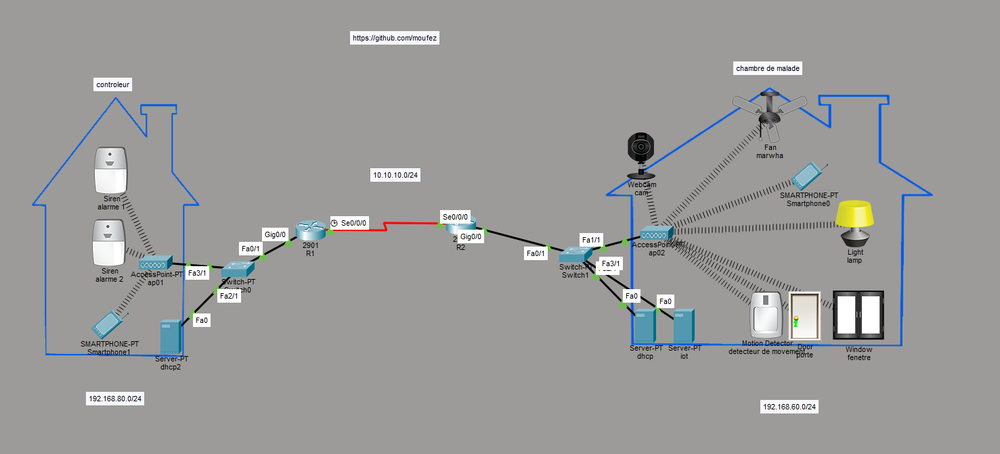

# 🏥 Smart Hospital IoT System 🤖🌐

This project is a **Smart Hospital Infrastructure** developed using **Cisco Packet Tracer**. It aims to improve patient safety, automate hospital room management, and enhance security using **IoT technologies**.

💡 The system transforms a traditional hospital into a smart environment where connected devices interact in real time to provide efficient and automated services.

---

## ⚙️ How the System Works

🚨 **Emergency Alert System:**
Patients can send emergency alerts directly from their smartphones 📱. These alerts are instantly received in the control room for quick response by medical staff.

🌡️ **Smart Window Control:**
Temperature sensors automatically control windows:

* High temperature 🔥 → Windows open
* Low temperature ❄️ → Windows close

👁️ **Patient Monitoring & Security:**
Motion sensors and cameras track patient movement inside the hospital. If any unauthorized movement or escape attempt is detected, an alarm is triggered immediately 🚨.

🌐 **Network Communication:**
The system is connected through a smart network using:

* 📡 DHCP for automatic IP assignment
* 🛣️ OSPF for dynamic routing between network segments
* 📶 Wireless Access Points for IoT device connectivity

---

## 🛠️ Technologies Used

* Cisco Packet Tracer
* IoT Devices & Sensors
* DHCP Server
* OSPF Routing Protocol
* Wireless Networking
* Smart Automation Systems
* Security Monitoring Systems

---

## 🎯 Project Goal

To simulate a real-world **Smart Hospital System** that improves safety, reduces manual workload, and demonstrates how IoT and networking technologies can be applied in healthcare environments.

---

## 🖼️ Project Preview

